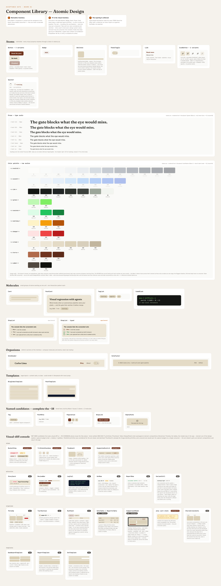

# acceptance-gate

[](https://github.com/climaa/acceptance-gate/actions/workflows/pr.yml)
[](https://github.com/climaa/acceptance-gate/releases)

Live: **[blog](https://acceptance-gate-blog.vercel.app)** — the argument ·
**[Storybook](https://acceptance-gate-storybook.vercel.app)** — the evidence ·
**[visual diff](https://acceptance-gate-visual-diff-ui.vercel.app)** — the tool,
working · **[manual](https://acceptance-gate-manual.vercel.app)** — the tool's
requirements, rendered.

**The pipeline is the product.** A public portfolio monorepo where every pull
request — including the ones that build the repo itself — walks through the
same gate:

```text
lint · typecheck · build · test · format · health · sandcastle · e2e  (parallel)  →  gate
```

`visual-diff` runs alongside the jobs above but deliberately never joins
`gate.needs`: it posts its report as a PR comment and fails its own job
loudly on a real diff, but a human approves the baseline in the PR — the
same as reviewing a code diff — rather than a numeric threshold silently
blocking (or silently passing) a merge. See
[`packages/visual-diff/README.md`](packages/visual-diff/README.md#ci-status)
and the reasoning in
[this post](apps/blog/content/posts/visual-regression-with-agents.mdx).

And the part that raises the bar: **this repo is built by its own published
agent pipeline.** The autonomous multi-agent orchestrator in
[`.sandcastle/`](.sandcastle/) — which I built and ran across previous
production work — plans, implements, reviews and merges GitHub issues through
the CI this repo builds for itself. The PR history is the evidence: pipeline
merges carry their model co-author trailer in the squashed commit.

> **Work in progress, in public — deliberately.** The
> [project board](https://github.com/users/climaa/projects/1) is the live,
> story-pointed roadmap; [open issues](https://github.com/climaa/acceptance-gate/issues)
> track in-flight work. Watching this repo means watching the pipeline work.

## What's here, what's coming

| Piece                                                           | Status                                                                                                                                                                                                                                                                                                                                                                                                             |
| --------------------------------------------------------------- | ------------------------------------------------------------------------------------------------------------------------------------------------------------------------------------------------------------------------------------------------------------------------------------------------------------------------------------------------------------------------------------------------------------------ |
| `.sandcastle/` — the orchestrator, with its hermetic test suite | ✅ committed, public                                                                                                                                                                                                                                                                                                                                                                                               |
| `designs/` — the design source of truth + PNG exports           | ✅ normative component inventory, two theme personalities, four exported boards including the visual-diff console pages                                                                                                                                                                                                                                                                                            |
| `apps/blog` — Next.js 16 App Router + MDX, consumes `@gate/ui`  | ✅ [published](https://acceptance-gate-blog.vercel.app) — posts, tags, RSS, sitemap, OG images, Cache Components + Partial Prefetching, error boundaries reporting to Bugsink                                                                                                                                                                                                                                      |
| `packages/ui` — atomic design system, token-only styling        | ✅ all 19 components of the normative inventory plus the 8 the console needed — 27 in four tiers, layering enforced by `eslint-plugin-boundaries`                                                                                                                                                                                                                                                                  |
| `packages/logger` — the shared logger, and the seam under it    | ✅ silent in production, and `error()` always forwards to a pluggable reporter — with the Bugsink adapter behind `@gate/logger/bugsink`, inert until a DSN exists. Call sites never learn which tracker is behind it                                                                                                                                                                                               |
| `apps/storybook` — the visual single source of truth            | ✅ [published](https://acceptance-gate-storybook.vercel.app) — every component rendered in isolation, plus the docs pages that describe the system                                                                                                                                                                                                                                                                 |
| `apps/e2e` — playwright-bdd acceptance suite                    | ✅ runs on every PR, blocks the merge — in `gate.needs`. Its second lane, `features/local/`, never runs in CI and writes to your own tree — see [the two `:local` scripts](#the-two-local-scripts-capture-promote-and-clean-up-after-themselves)                                                                                                                                                                   |
| `packages/visual-diff` — the self-built visual regression CLI   | ✅ reports on every PR, never auto-blocks — see [its README](packages/visual-diff/README.md#ci-status)                                                                                                                                                                                                                                                                                                             |
| `apps/visual-diff-ui` — the console that reviews those runs     | ✅ [published](https://acceptance-gate-visual-diff-ui.vercel.app) — the visual-diff review console: sets, reports and history, the run panel with its live log and its two job modes, and the report's tier sections, review loop, accessibility treatment and the three-up viewer behind its comparison modal; sample mode browses the #242 regression report; error boundaries report to Bugsink like the blog's |

## The design system, in one rule

**No component hardcodes a visual value.** Everything resolves through a
custom property in [`packages/ui/src/tokens.css`](packages/ui/src/tokens.css);
dark mode remaps only the semantic roles. The two themes are deliberate
opposite personalities — editorial parchment with terracotta in light,
terminal lime on green-black in dark — so a theme-wiring bug can never hide
as "both themes look the same":



## Quick start

```bash
pnpm install
cp .env.example .env  # turbo remote-cache credentials — see the comments inside
pnpm dev              # blog on :3000
pnpm lint && pnpm typecheck && pnpm build && pnpm test
pnpm format:check && pnpm health:check
pnpm test:sandcastle  # the orchestrator's own hermetic suite
```

Those last three lines are the first seven parallel gate jobs from the diagram
above, in the same order. `e2e` is the eighth; it needs a Chromium download
before its first local run — see [`apps/e2e/README.md`](apps/e2e/README.md).

### The two `:local` scripts capture, promote, and clean up after themselves

```bash
pnpm e2e:ui                          # the acceptance suite, in Playwright UI Mode
pnpm e2e:ui:local                    # ⚠️ NOT its twin — this one writes
pnpm test:local                      # ⚠️ same, headless
```

`e2e:ui` runs `features/acceptance/` against seeded worlds this config builds and
throws away. Nothing you own is involved.

The two `:local` scripts run `features/local/` against **your own tree**, and
both scenarios in that lane write. The first works on your `.visual-diff`: it
captures your whole corpus inside the pinned container, compares it, promotes it,
and then **removes every one of those again**. It needs a running Docker daemon
and takes minutes. The second works on `apps/blog/content/posts`: it writes one
post, proves the dev server serves it without a restart, and removes it again —
the claim no built app can make, because `proxy.ts` caches its read of that
directory in production and must not in development.

Both cost you nothing, which is the part worth knowing: each creates what it
needs rather than borrowing something of yours, and removes it again — the first
starts on a console that has captured nothing and leaves one behind, the second
never names a post you wrote. Nothing of yours is deleted, and the lane can run
twice in a row.

That is the lane's purpose rather than a hazard it happens to carry: seeded
fixtures can only prove the console works against data shaped the way the seed
imagined, and this asks whether it works against yours. But the two script names
sit one word apart, so the difference is written here rather than left to be
discovered. The long form, including the guards that stop an untagged scenario
writing, is in [`apps/e2e/README.md`](apps/e2e/README.md#the-local-lane) and the
Storybook page _Docs/QA/Acceptance Suite Locally_.

Run turbo through the `pnpm` scripts rather than `pnpm turbo run ...` directly.
The scripts wrap turbo in `dotenv -e .env -o --` so its credentials come from
this repo's `.env` and never from your shell — a `TURBO_TEAM` exported in a
shell profile would otherwise apply to every repo on the machine.

Toolchain pinned: pnpm 11.20.0 (`packageManager` + sha512), Node 22 (`.nvmrc`),
Turborepo ^2.10.

## How the autonomous loop works

1. I decompose the roadmap into self-contained, story-pointed GitHub issues
   (dependency notes, verification commands, do-not-touch lists).
2. `pnpm sandcastle` plans the open backlog, then per issue: implements in a
   Docker sandbox → reviews with a second agent → opens a PR → squash
   auto-merge once the `gate` check is green.
3. `sc:*` labels route model and reasoning effort per issue. Testing
   conventions are enforced in review: AAA shape, testing-pyramid placement,
   every bug fix lands with its regression test.

Rules that keep it honest live in
[`.sandcastle/agent-docs/CODING_STANDARDS.md`](.sandcastle/agent-docs/CODING_STANDARDS.md) —
including the one that matters most: _`.feature` files describe product
requirements and are never edited to make a test pass._

## License

[MIT](LICENSE)
