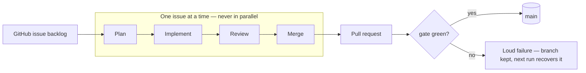
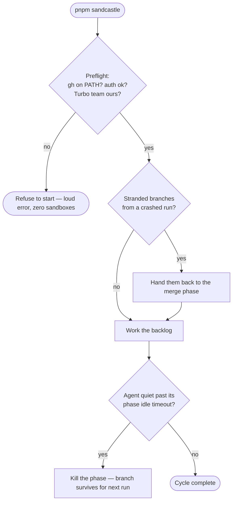
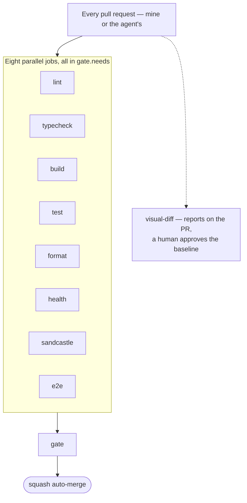

There is a folder in this repository called [`.sandcastle/`](https://github.com/climaa/acceptance-gate/tree/main/.sandcastle), and it is the reason the repo's tagline says *the pipeline is the product*. Sandcastle is a multi-agent orchestrator whose only input is the GitHub issue backlog: it reads the open issues, decides which ones are unblocked, implements them in isolated Docker sandboxes, reviews the result with a second agent, opens a pull request and lets CI decide whether it merges. The pull requests it opens are indistinguishable from mine in every way except one — the squashed commit carries the model's co-author trailer, so the history itself is the evidence. The [closed issues](https://github.com/climaa/acceptance-gate/issues?q=is%3Aissue%20state%3Aclosed) are worth browsing for the same reason: the planner's entire view of the backlog is a single `gh issue list --state open` in its prompt, so the only way an issue leaves that view is by being finished — the closed list is the pile of worked plans, each one an example of what the loop was asked to do and did.

This post answers the three questions I get about it, in order: why is an agent orchestrator sitting inside a frontend portfolio repo, what does it actually mean to leave it running *AFK*, and — the part I care most about — how the rest of the tooling in this monorepo is arranged so that trusting it is rational rather than reckless.

## The loop, in one diagram

Every issue passes through four phases, each a separate agent with its own prompt, its own model and its own reasoning-effort budget:

That is the whole picture, and the simplicity is deliberate: every diagram in this series is plain Mermaid, written inline in the MDX right next to the prose it illustrates — no generated assets, no notation to learn first, nothing you have to open in a new tab to read.

Three details the diagram compresses, because they took real production incidents to learn:

**Issues run serially, not in parallel.** Not an up-front design decision — a concurrent `pnpm install` deadlocked in production on pnpm 10.x, and the lesson now lives as a comment in the code. Parallelism also multiplies token spend at exactly the moment you are not watching; one issue at a time keeps the cost curve boring.

**Implement and Review share one Docker sandbox per issue.** The reviewer looks at the same filesystem the implementer wrote to, on a real `git worktree` forked under `.sandcastle/worktrees/` — my checkout is never mounted, never touched. The agent can run in what would otherwise be a dangerous permission mode precisely because the blast radius is a disposable worktree inside a container.

**Model and effort are routed per issue, by label.** `sc:implementer:opus-5`, `sc:reviewer:effort:low` and [the rest of the `sc:` vocabulary](https://github.com/climaa/acceptance-gate/labels?q=sc%3A) resolve in a fixed order — `PROFILES < env var < label` — and any value outside the accepted vocabulary fails the run *before* a sandbox exists. This is also the budget control: a three-line `.gitignore` issue does not get the same model effort as a component refactor, which is how a full backlog run stays inside a Claude Max plan instead of consuming it.

## Why it is in *this* repository

The short answer: because a claim about quality engineering is worthless without a hostile witness, and an autonomous agent is the most hostile witness I can hire.

This monorepo exists to demonstrate a way of working — acceptance criteria as contracts, a CI gate that blocks rather than advises, a design system where no component hardcodes a visual value. I could assert all of that in a README. Instead, the repo is built *by* the pipeline it describes: Sandcastle has to survive the same gate as any human contributor, and it has no ego, no context from hallway conversations, and no ability to say "trust me". If the conventions only work when a careful human applies them, the agent exposes that immediately. If they hold, the merged PR history — trailer and all — is proof that the process, not the person, carries the quality.

There is also an honest career argument, and I would rather state it than have it inferred: I built and ran this orchestrator pattern across previous production work that I cannot show. Publishing Sandcastle here, running against a public backlog with public PRs, converts "I have done this" into "watch it happen". The [project board](https://github.com/users/climaa/projects/1) is the live roadmap, and it is instrumented rather than decorative: every ticket cross-links its GitHub issue and carries story points, so the Kanban board measures throughput instead of just displaying cards. The first fully autonomous cycle — plan, implement, review, PR, green gate, squash merge, issue closed, with the "🏖️ Generated by Sandcastle" signature untouched in the PR body — is [PR #16](https://github.com/climaa/acceptance-gate/pull/16), small on purpose and real.

## The AFK advantage

*AFK — away from keyboard* — is the actual product of all this machinery. Not speed: a supervised agent with me watching is faster per issue. What Sandcastle buys is that progress continues when I am not there — overnight, during a school run, while I am in an interview — and that the definition of "safe to continue without me" is written down and enforced rather than vibes.

Leaving an agent unattended changes which failures matter. When you are watching, a silent failure is an annoyance; you notice the weird output and intervene. When you are AFK, a silent failure compounds for hours. So the entire design bias of `.sandcastle/` is that **silence is the worst possible outcome**, and every ambiguous state is converted into either a loud stop or an automatic recovery:

Concretely: a missing `gh` binary would silently return empty issue lists, so a preflight refuses to start without it — and the credentials it expects are spelled out in [`.sandcastle/.env.example`](https://github.com/climaa/acceptance-gate/blob/main/.sandcastle/.env.example), down to the demand that `GH_TOKEN` be a fine-grained PAT scoped to this one repository. A `TURBO_TEAM` leaked from another project's shell profile would silently write into someone else's build cache, so the orchestrator compares the repo's own `.env` against what `turbo link` recorded and disables the cache — logging why — on any mismatch. Each phase ends by emitting an explicit completion signal, each has its own idle timeout, and a merge phase that dies mid-run leaves branches the *next* run detects and hands back automatically. None of this makes the agent smarter. All of it makes the agent safe to not watch.

The other half of AFK is economic. Unattended time is only free if it does not burn the month's model budget while you sleep — which is what the per-issue effort labels, the serial execution and the fail-before-sandbox validation are collectively for. The expensive resource is routed with the same discipline as the code.

## How the other tools align with quality

Sandcastle never decides its own work is done. That decision belongs to the gate, and the gate treats the agent exactly as it treats me:

Each job is one tool holding one line, and together they cover what an unattended agent could otherwise erode:

The **e2e** job runs the playwright-bdd acceptance suite, and its `.feature` files are the anchor of the whole arrangement: they are product requirements, and the agent is forbidden — by [`CODING_STANDARDS.md`](https://github.com/climaa/acceptance-gate/blob/main/.sandcastle/agent-docs/CODING_STANDARDS.md), enforced in review — from editing them to make a test pass. If it believes a scenario is wrong, it must say so in the PR and wait for a human. That is the same argument I made in [the Gherkin post](/blog/gherkin-specs-that-survive) before any agent touched this repo: the specification has to be something the implementer cannot move.

The **health** job is the complexity gate — a cognitive-complexity ceiling of 20 per function, enforced by script, with extraction as the documented remedy. An agent iterating unsupervised tends to accrete; this is the tool that forces it to decompose instead. **lint** carries `eslint-plugin-boundaries`, so the design system's four-tier layering is an import-graph rule, not a convention; a component that reaches across tiers fails CI regardless of who wrote it. **format**, **typecheck**, **build** and **test** are exactly what they say, and the **sandcastle** job is the orchestrator's own hermetic test suite — the watcher is itself watched, on every PR, including PRs the watcher opened.

And then there is **visual-diff**, the one deliberate exception. It runs on every PR and posts its report, but it never joins `gate.needs`: a human approves visual baselines, the same way a human reviews a code diff. The approval itself happens in a dedicated [review UI](https://acceptance-gate-visual-diff-ui.vercel.app/) — a human-in-the-loop checkpoint where each changed screenshot is accepted into the baseline or refused, one explicit decision at a time. That line is drawn on purpose. Everything mechanical about quality is automated so hard that the agent cannot merge around it; the one judgment that is genuinely aesthetic stays with a person. I wrote up the reasoning in [the visual regression post](/blog/visual-regression-with-agents) — it is the same "enforcement vs claim" test applied to pixels.

That is the alignment, and it is the actual thesis of the repo: **AFK is not a property of the agent. It is a property of the gate.** The orchestrator is replaceable — a better model, a different loop, someone else's framework. What makes leaving the keyboard rational is that every path to `main` runs through the same eight blocking jobs, loudly, with the failure modes designed before the autonomy.

## Where this series goes next

This post is the map. The deeper cuts each take one piece of the loop and hold it to the same question the gate asks — *is this an enforcement, or a claim?* The sandbox isolation model, the review contract that keeps an agent's diffs honest, and the economics of running a backlog on a fixed model budget are each worth their own post, and they will link back here.
